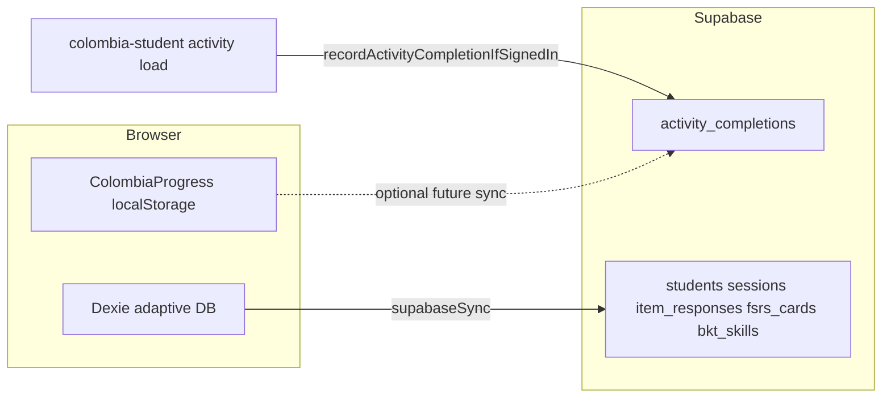

# Repo cleanup backlog and Supabase follow-ups

Internal maintainer notes: deferred housekeeping and weekend work for teacher visibility of activity data and cloud-backed hub progress.

---

## 1. Deferred repo cleanup

- **`.gitignore` and `index.html`:** The global `**/index.html` rule in `.gitignore` is broad. Narrow or replace it so student `student_site/index.html` files remain easy to track without `git add -f`.
- **Teacher-only / licensed content:** Move or archive root PDFs, slides, and folders listed in `.gitignore` (e.g. licensed curriculum trees) to external storage or a private repo; keep this public repo aligned with what GitHub Pages should ship.
- **Duplicate deck:** Remove `colombia_vocab (1).pptx` at repo root only after confirming it duplicates the canonical file.
- **`.claude/worktrees/`:** Optional: delete nested worktree copies or add `.claude/` to `.gitignore` if unused.
- **DRY large HTML:** Longer term, extract shared JS for duplicated pages (e.g. Colombia vocab review SP1/SP2) into `unidad_colombia/student_site_assets/`.

---

## 2. Supabase: activity completions and progress (weekend)

### What already exists

- **Schema:** `activity_completions` in [`unidad_colombia/student_site_assets/supabase-schema.sql`](../unidad_colombia/student_site_assets/supabase-schema.sql) — `user_id`, `course_key`, `activity_id`, `occurred_at`, `payload` (jsonb), with RLS so each auth user only sees their own rows.
- **Client insert:** [`recordActivityCompletionIfSignedIn`](../unidad_colombia/student_site_assets/js/activityCompletionsSync.js) runs when the student is signed in; [`colombia-student.js`](../unidad_colombia/student_site_assets/colombia-student.js) calls it via `tryRecordActivityCloudCompletion` when an activity page loads.
- **Adaptive mirror (Dexie → Postgres):** `students`, `sessions`, `item_responses`, `fsrs_cards`, `bkt_skills` — synced via [`supabaseSync.js`](../unidad_colombia/student_site_assets/js/supabaseSync.js). This is separate from hub “lesson progress” in localStorage.

### Gaps to close later

**Teacher visibility of `activity_completions`**

The publishable (anon) key in the browser cannot list all students; RLS is by design. Options:

- **Quick:** Supabase Dashboard → Table Editor or SQL for ad-hoc queries (see also [`supabase-sync-settings.html`](../unidad_colombia/student_site_assets/supabase-sync-settings.html)).
- **Better:** A small **server-side** script (Node with `service_role`, run only on a machine you control) or a **Supabase Edge Function** with teacher allowlisting — never expose `service_role` in static HTML or client JS.

**Progress beyond completion rows**

[`colombia-progress.js`](../unidad_colombia/student_site_assets/colombia-progress.js) stores lesson drafts, section completion, and last-activity pointers in **localStorage** only. Cloud inserts today are mainly adaptive sync plus optional `activity_completions` on visit.

Next steps when you implement:

1. Decide which fields must survive device loss (e.g. per-day section maps, rubric drafts).
2. Either enrich `activity_completions.payload` with structured snapshots, or add a dedicated table (e.g. `hub_progress`) keyed by `user_id` + `course_key` with RLS, and sync from `ColombiaProgress` on a throttle while signed in.

### Data flow (reference)

---

## 3. Out of scope for quick cleanup passes

- Deleting or moving large teacher or licensed archives without explicit confirmation.
- Building a full teacher dashboard UI in-repo (unless you choose to scope that separately).
